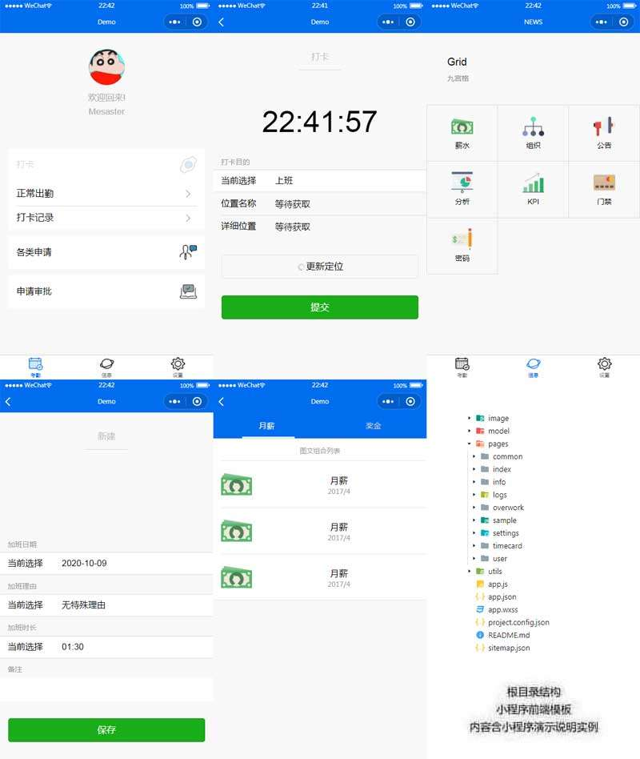

# mobile attendance

## 截图


## 多语言支持相关数据结构

### 语言相关全局变量
> Sample Code
```js
//app.js
App({
  onLaunch: function () {
    //进入应用时检查语言设置
    var language = wx.getStorageSync('selectedLanguage');
    if(language){
      this.globalData.settings.language = language;
    }else{
      //TODO 使用系统语言设定 user-info COUNTRY      
      this.globalData.settings.language = 0; //暂时默认为中文 
    },
  globalData:{
    settings:{
      language: null
    },
    userInfo:null
  }
})
```
- App启动时读取LocalStorage, 取得当前语言设置, 并写入全局变量
- 各页面通过读取全局变量 ```settings.language``` 来确定当前使用语言


### Setting界面
> Sample Code
```js
  // pages/settings/settings.js
  languages: ["简体中文", "English"], // "繁体中文", "日本語" may be supported in the future
```
### [Picker组件](https://mp.weixin.qq.com/debug/wxadoc/dev/component/picker.html)

> Sample Code

```js
  // pages/timecard/normal/normal.js
  checkType: [
    [{id: "clockIn", msg: "上班"}, {id: "clockOut", msg: "下班"}]                 // Simplified Chinese Support
    ,[{id: "clockIn", msg: "Clock In"}, {id: "clockOut", msg: "Clock Out"}]      // English Support
    ,[......]                                                                    // Other possible languages
  ]
```

- 当 range 是一个 Object Array 时，通过 range-key 来指定 Object 中 key 的值作为选择器显示内容

```html
  <picker value="{{checkType[uindex][index].id}}" range="{{checkType[uindex]}}" range-key="msg">
    <view class="weui-input">{{checkType[uindex][index].msg}}</view>
  </picker>
```
- 注意picker的 _value属性_ 为 ```{{checkType[uindex][index].id}}```
- 通过以下数据结构设计, 实现以不同语言的显示, 提交表单时为相同的id

```js
  [                                                   // Language
    {id: "same id", msg: "multiple language msg"}     // Options of current language
  ]
``` 
