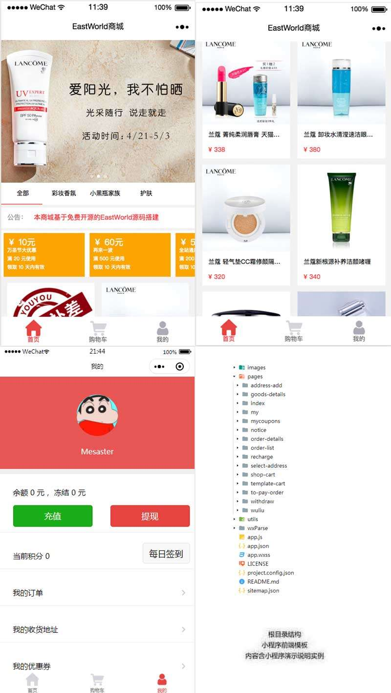

# 化妆品商城
微信小程序商城

## 截图

## 使用说明

> 商城模块
> > 在 API 列表中选择使用以下API模块：
>
> > >系统参数设置： 用于配置商城名称；
>
> > > 小程序用户注册接口：实现用户注册；
>
> > > 小程序登录接口：实现用户自动登录；
>
> > > App Banner管理接口: 设置商城首页轮播图片
>
> > > 在线支付接口：完成小程序在线支付；
>
> > > 商品类别接口；
>
> > > 商品列表和详情接口；
>
> > > 商城订单管理接口；
>
> > > 用户收货地址接口；
>
> > > 优惠券接口；
>
> > > 平台公告模块
>
> > > 每日签到【签到送积分】
>
> 修改源码中  app.js 文件
> > > globalData:{
>  userInfo:null,
>  subDomain:"mall"
>}

- api接口还在重新整合中......

