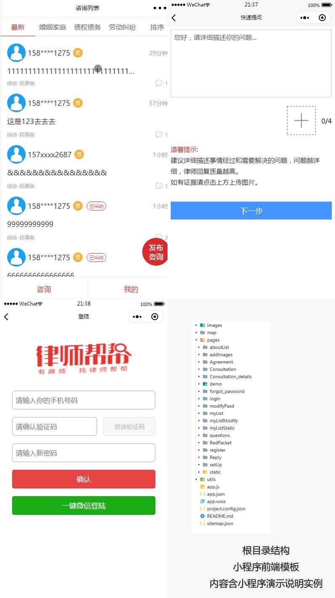

### 律师法务咨询小程序
因公司需求要完成一个跟[线上](https://m.12348.com.cn/)一样的电商平台，增加客户量的递增。本项目属于长期维护功能也会不断的递增
### 目录结构
* map — 存放地图的js文件
* images — 存放项目图片
* pages — 存放项目页面相关文件
* utils — 存放公共的js文件，可require引入
### 项目截图
  
### 预览地址
打开微信 => 搜索 "律师帮帮法律咨询"
